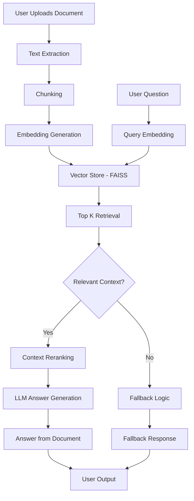
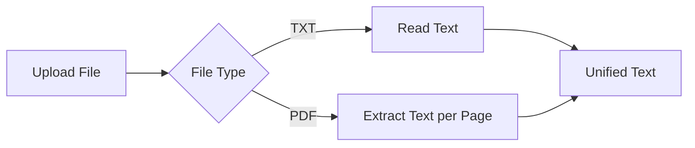
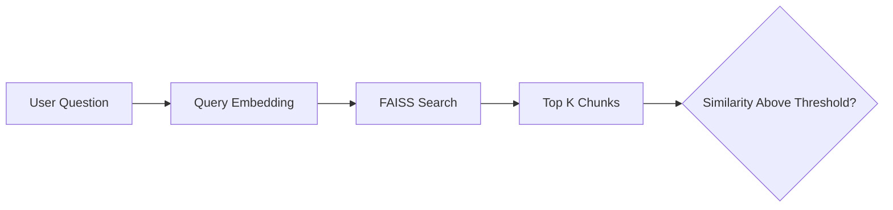
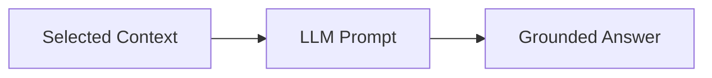

# **CleaRAG**

### A Transparent Retrieval-Augmented Question Answering System

---

## Overview

**CleaRAG** is a document-grounded Question Answering (QA) system built using **Retrieval-Augmented Generation (RAG)**.
It allows users to upload documents (TXT or text-based PDF), ask natural language questions, and receive answers that are **explicitly grounded in retrieved document context**.

The system prioritizes **transparency and safety** by explicitly showing:

* Extracted document text
* Retrieved context
* Exact context chunks used for answering
* Whether an answer was generated from document context or fallback logic

This project was developed as a **time-boxed prototype** to demonstrate practical RAG design, engineering judgment, and responsible LLM usage.

---

## Repository Structure

```
CleaRAG/
├── CleaRAG.ipynb     # Exploratory notebook (all attempts, experiments, debugging)
├── run.py             # Single runnable RAG application
└── README.md
```

---

## High-Level System Flow



---

## Detailed Pipeline Breakdown

### 1. Document Ingestion

* Accepts `.txt` and **text-based `.pdf`** documents
* PDF text is extracted page-by-page using `pypdf`
* Extracted text is displayed to the user for transparency



---

### 2. Chunking Strategy

Documents are split into overlapping chunks to preserve semantic continuity.

* Chunk size: ~300 tokens
* Overlap: ~50 tokens


---

### 3. Embedding and Vector Storage

* Each chunk is embedded using a pre-trained sentence embedding model
* Embeddings are indexed using FAISS for fast similarity search


---

### 4. Query Processing and Retrieval

* User question is embedded using the same embedding model
* FAISS retrieves the top-K most similar chunks
* A similarity threshold prevents weak matches



---

### 5. Relevance Reranking

* Retrieved chunks are lightly reranked to prioritize relevance
* Improves grounding and reduces redundancy


---

### 6. Answer Generation

* Selected context is passed to a lightweight instruction-tuned LLM
* The model is instructed to answer **only from the provided context**
* Hallucination is explicitly discouraged



---

### 7. Fallback Handling

If no sufficiently relevant context is found:

* The system does **not fabricate an answer**
* A fallback mechanism is triggered
* The user is explicitly informed


---

## Tools and Models Used

* **Language:** Python
* **Platform:** Google Colab / Local Python
* **Embedding Model:** `all-MiniLM-L6-v2`
* **Vector Store:** FAISS
* **Language Model:** `google/flan-t5-base`
* **PDF Parsing:** `pypdf`
* **Interface:** Gradio

---

## How to Run

### Option 1: Run the Single Script (`run.py`) — Recommended

#### 1. Install dependencies

```bash
pip install sentence-transformers faiss-cpu transformers accelerate gradio pypdf
```

#### 2. Run the application

```bash
python run.py
```

#### 3. Use the interface

* Upload a `.txt` or text-based `.pdf` document
* Enter a question
* View:

  * Extracted document text
  * Retrieved context
  * Context chunks used
  * Final answer and its source

---

### Option 2: Run the Notebook (`CleaRAG.ipynb`)

1. Open `CleaRAG.ipynb` in Google Colab or Jupyter
2. Run cells top-to-bottom
3. The notebook documents:

   * All experiments
   * Debugging steps
   * Intermediate attempts
   * Final working pipeline

The notebook reflects the **entire development process**, while `run.py` represents the **final cleaned implementation**.

---

## AI Tool Usage

ChatGPT was used selectively to:

* Validate the RAG pipeline structure
* Debug HuggingFace pipeline configuration issues

All architectural decisions, implementation logic, and tradeoffs were made manually.

---

## Limitations

* Only text-based PDFs are supported (no OCR for scanned documents)
* Lightweight LLM limits deep multi-step reasoning
* Relevance reranking is intentionally simple
* Web-search fallback is a demonstrative placeholder (no live API)
* In-memory caching is not persistent across sessions

---

## Sample Outputs

### Sample Query 1

**Input**

```
Give me the correct coded classification for the following diagnosis:
Recurrent depressive disorder, currently in remission
```

**Output**

```
The diagnosis corresponds to ICD-10 code F33.4, which denotes recurrent depressive disorder currently in remission.
```

---

### Sample Query 2

**Input**

```
What are the diagnostic criteria for Obsessive-Compulsive Disorder (OCD)?
```

**Output**

```
Obsessive-Compulsive Disorder is characterized by obsessions, compulsions, or both.
These symptoms are time-consuming or cause significant distress or impairment and
are not attributable to substances or another medical condition.
```

---


CleaRAG demonstrates a **clean, transparent, and defensible** implementation of a Retrieval-Augmented Question Answering system.
The project emphasizes grounded answers, interpretability, and sound engineering tradeoffs while remaining realistic within time and resource constraints.

---
