# **CleaRAG**

### A Transparent Retrieval-Augmented Question Answering System

---

## Overview

**CleRAG** is a document-grounded Question Answering (QA) system built using **Retrieval-Augmented Generation (RAG)**.
It enables users to upload documents (TXT or text-based PDF), ask natural language questions, and receive answers that are **explicitly grounded in retrieved document context**.

The system prioritizes **transparency and safety** by:

* Displaying extracted document text
* Showing retrieved context and exact chunks used
* Clearly indicating whether answers come from the document or from fallback logic

This project was developed as a **time-boxed prototype** to demonstrate practical RAG design, engineering judgment, and responsible LLM usage.

---

## Key Capabilities

* Retrieval-augmented question answering over documents
* Support for **TXT** and **text-based PDF** files
* Explicit display of:

  * Extracted document text
  * Retrieved context
  * Context chunks used
* Semantic retrieval using vector similarity search
* Lightweight relevance reranking
* In-memory caching for repeated queries
* Transparent fallback behavior when no relevant context is found
* Simple interactive interface using Gradio

---

## High-Level System Flow

---

## Detailed Pipeline Breakdown

### 1. Document Ingestion

* Users upload a `.txt` or text-based `.pdf` document.
* For PDFs, text is extracted page-by-page using `pypdf`.
* Extracted text is displayed to the user for transparency.

---

### 2. Chunking Strategy

Documents are split into overlapping chunks to preserve semantic continuity.

* Chunk size: ~300 tokens
* Overlap: ~50 tokens

This balances:

* Retrieval accuracy
* Context preservation
* LLM input length constraints

---

### 3. Embedding and Vector Storage

* Each chunk is embedded using a pre-trained sentence embedding model.
* Embeddings are stored in a FAISS index for fast similarity search.

---

### 4. Query Processing and Retrieval

* User question is embedded using the same embedding model.
* FAISS retrieves the top-K most similar chunks.
* A similarity threshold ensures weak matches are rejected.

```mermaid
flowchart LR
    A[User Question] --> B[Query Embedding]
    B --> C[FAISS Search]
    C --> D[Top-K Chunks]
    D --> E{Similarity ≥ Threshold?}
```

---

### 5. Relevance Reranking

* Retrieved chunks are lightly reranked to prioritize relevance.
* This avoids redundancy and improves answer grounding.

---

### 6. Answer Generation

* Selected context is passed to a lightweight instruction-tuned LLM.
* The model is explicitly instructed to answer **only from the context**.
* If the answer is not present, the system refuses to hallucinate.

---

### 7. Fallback Handling

If no sufficiently relevant context is found:

* The system **does not fabricate an answer**
* A fallback mechanism is triggered
* The user is explicitly informed that document context was insufficient

This behavior is transparent and auditable.

---

## Tools and Models

| Component      | Choice                |
| -------------- | --------------------- |
| Language       | Python                |
| Platform       | Google Colab / Local  |
| Embeddings     | `all-MiniLM-L6-v2`    |
| Vector Store   | FAISS                 |
| Language Model | `google/flan-t5-base` |
| PDF Parsing    | `pypdf`               |
| Interface      | Gradio                |

---

## AI Tool Usage

ChatGPT was used selectively to:

* Validate RAG pipeline structure
* Debug model and pipeline configuration issues
* Refine prompt design and error handling

All architectural decisions, tradeoffs, and implementation were performed manually.

---

## Limitations

* Supports only text-based PDFs (no OCR for scanned documents)
* Uses a lightweight LLM, limiting deep reasoning
* Relevance reranking is intentionally simple
* Web fallback is a demonstrative placeholder, not a live API integration

---

## Future Improvements

* Integrate real web search APIs for fallback retrieval
* Tokenizer-aware chunking
* Advanced reranking (e.g., full MMR)
* Persistent caching
* OCR support for scanned documents

---

CleaRAG demonstrates a **clean, transparent, and defensible** implementation of a Retrieval-Augmented Question Answering system.
The project emphasizes **grounded answers, interpretability, and engineering judgment**, making it suitable as both a prototype and an evaluative submission.

---
